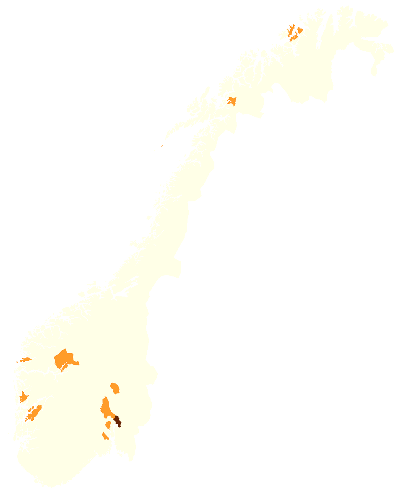
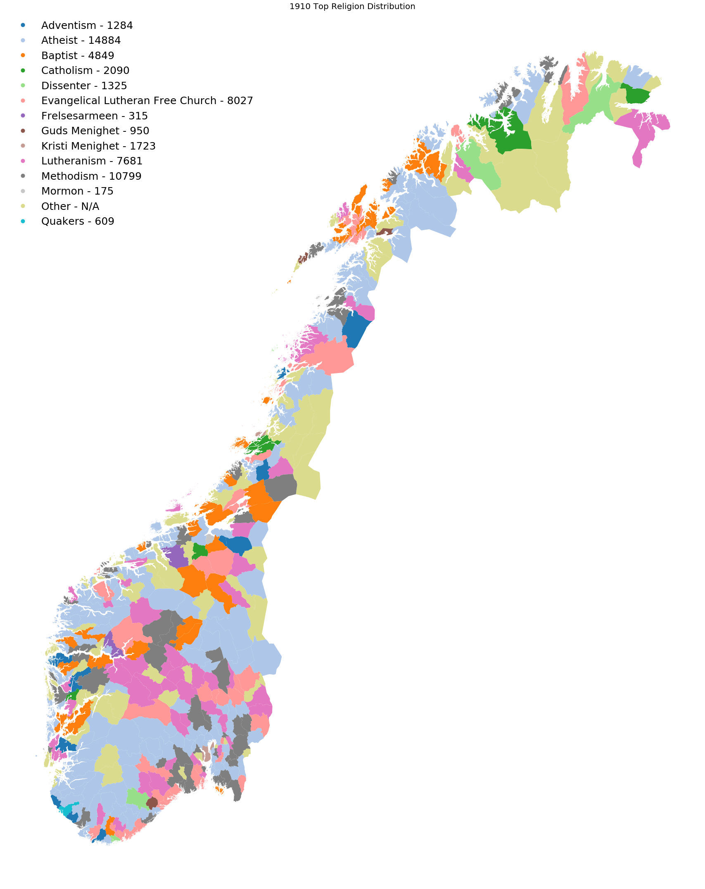

# Norwegian Census Data Analysis using Hadoop
DAT500 MSc course

## Configuring the cluster (tested on Ubuntu 16.04 and 18.04)
cd into setup

### Shared
* Ensure that setup_env.sh has correct addresses for /etc/hosts/.
* Run sudo setup.sh, this will setup the environment, install necessary libraries and Hadoop.
* Copy files & folders in /scripts/* to /usr/local/hadoop/
* Ensure that Python 3 is the default Python interpreter! And that it is a version prior to 3.8.0.
* Ensure that Java 8 is the default Java version. Check ~/.bashrc and ~/.profile for potential Java 11 overrides.

### Master Node Only
* Run sudo setup_spark.sh, this will install Spark.
* Copy files & folders in /master-only/ to /usr/local/hadoop/
* Copy files & folders in /spark/ to /usr/local/spark/
* Update /usr/local/hadoop/etc/hadoop/workers to include your workers. (slave nodes)

### Slave Node Only
* Copy files & folders in /slave-only/ to /usr/local/hadoop/

### Finally
Format the namenode like this, hdfs namenode -format (type in terminal)

## Running jobs @ master

### Starting/Stopping
* Start Hadoop and Spark, run start-dfs.sh, start-yarn.sh, and start-history-server.sh.
* Stop Hadoop and Spark, run stop-history-server.sh, stop-yarn.sh and stop-dfs.sh.

### Testing
To test if Hadoop is working, simply run setup/setup_runtest.sh.

### When Hadoop and Spark is up
* Regular MapReduce, /run/hadoop-streaming.sh <file_mapper.py> <file_reducer.py> <input-from-hdfs> <output-to-hdfs>
* With MRJob, python3 some_file.py --hadoop-streaming-jar /usr/local/hadoop/share/hadoop/tools/lib/hadoop-streaming-3.1.1.jar -r hadoop hdfs:///data/input_data.csv --output-dir hdfs:///output/xyz --no-output
* With Spark, spark-submit --master yarn some_file.py

### To generate the results for this project (assuming you have access to our dataset)
cd into src and execute run.sh (~/dat500/src/)

## Visualizing the results locally
* Sync results retrieved from Hadoop & Spark
* cd into src
* conda install geopandas
* conda install geoplot -c conda-forge
* conda install -c conda-forge cartopy
* pip install -r requirements.txt
* Open visualize.ipynb to visualize results

(the CSV dataset was generated from the original census dataset by running src/merge_data.ipynb)

## Troubleshooting
* Check if /usr/local/hadoop/etc/hadoop/hadoop-env.sh has any faulty paths.
* Python 3.6.9 was built from source, and should be the default Python version. However if a different version is preferred, update /usr/local/spark/conf/spark-env.sh to use python3.X for its Python drivers.

## Reference(s) / Guide(s)
* Check https://codethief.io/hadoop101/ for similar cluster configuration / setup.

# Example Results

